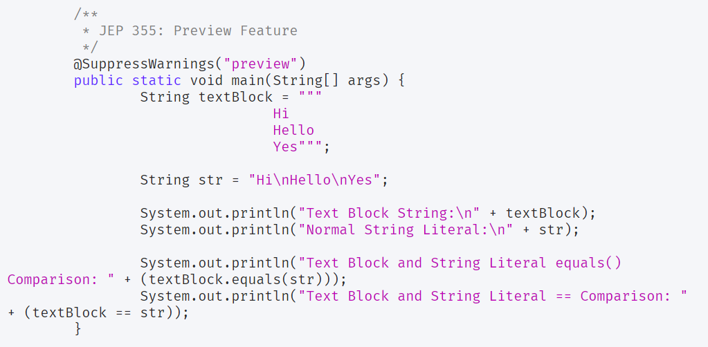
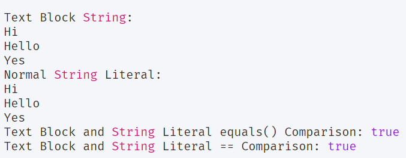

## New Methods in String Class for Text Blocks
Il existe trois nouvelles méthodes dans la classe String, associées à la fonctionnalité de blocs de texte.

1. `formaté` (Object… args): c'est similaire à la méthode String format (). Il est ajouté pour prendre en charge la mise en forme avec les blocs de texte.
2. `stripIndent()`: utilisé pour supprimer les caractères d'espacement occasionnels du début et de la fin de chaque ligne du bloc de texte. Cette méthode est utilisée par les blocs de texte et préserve l'indentation relative du contenu.
3. `translateEscapes()`: renvoie une chaîne dont la valeur est cette chaîne, avec des séquences d'échappement traduites comme si dans une chaîne littérale.

## Blocs de texte - JEP 355
- CODE   

  

-  OUTPUT   

  

## Switch Expressions Enhancements 

1. «break» a été remplacé par «yield» pour renvoyer une valeur de l'instruction case. 
2. Utiliser multiple valeur affectes a "case" en une seule fois.

`int x = switch (choice) {` 
		`case 1, 2, 3:` 
			`yield choice;` 
		`default:` 
			`yield -1;` 
		`};`  

Check More in this link: [Features of Java 13](https://www.journaldev.com/33204/java-13-features)
`